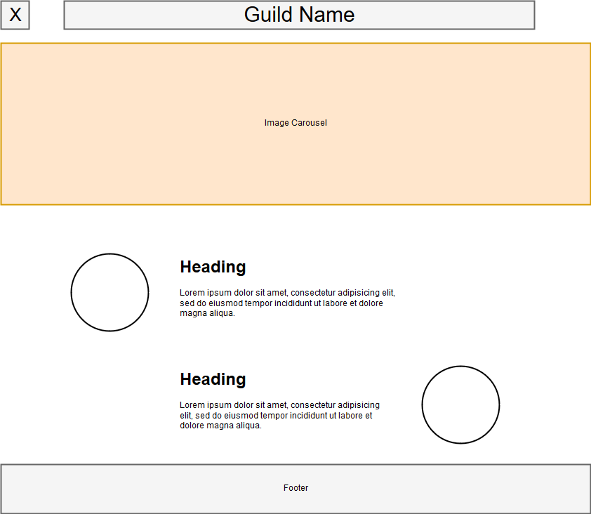

# Red Water Marauders
#### Client Web App

My Client came to me, wanting to create an app that has a sign up and log in page, a forum or chat room to communicate with guild members.  I sat down with him and told him what technologies I could use to present to create his web app that he wanted.

### Technologies as of July 9th, 2018
* MongoDB (mLab?)
* Express.JS
* React.JS
* Node.JS 
* Socket.io (used for possible chat room functionality)
* Passport.JS
* GW2 API (for character information and inventory stats)

### Current Mock up of the main page

##### Copyright (c) 2018 Jason Goncalves